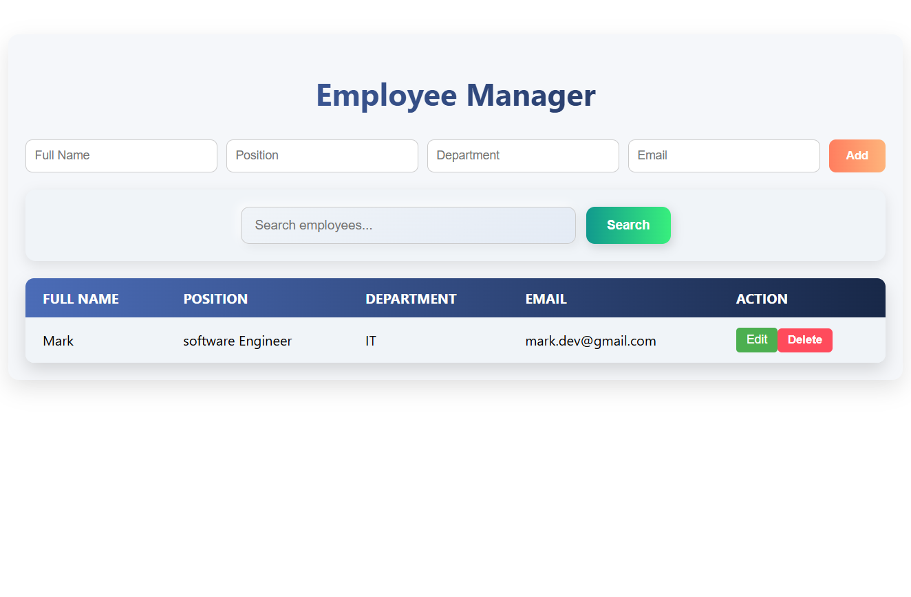

# Employee Manager

A full-stack MERN application to manage employees. Users can add, edit, delete, and search employees with real-time suggestions.

  
  
  
  
  
  
  


## Features

- **Add Employees**: Add new employees with Full Name, Position, Department, and Email
- **Edit Employees**: Update existing employee information
- **Delete Employees**: Remove employees from the system
- **Smart Search**: Real-time search suggestions as you type
- **Inline Validation**: Form validation to ensure all required fields are filled
- **Duplicate Email Check**: Prevents adding employees with duplicate email addresses
- **Responsive UI**: Works well on desktop, tablet, and mobile devices

## Prerequisites

Before running this application, make sure you have the following installed:
- Node.js (v14 or higher)
- MongoDB (local installation or MongoDB Atlas account)
- npm or yarn

## Installation

Prerequisites

Node.js (v14 or higher)

MongoDB (local installation or MongoDB Atlas account)

npm or yarn

Installation

Clone the repository

git clone <your-repo-link>
cd employee-manager


Install backend dependencies

cd backend
npm install


Install frontend dependencies

cd ../frontend
npm install


Set up environment variables

Create a .env file inside the backend folder

Add the following:

PORT=5000
MONGODB_URI=mongodb://localhost:27017/employee_manager
NODE_ENV=development


Start the backend server

cd backend
npm start


Start the frontend

cd frontend
npm start

```bash
📂 Folder Structure
Employee_Manager/
├── backend/
│   ├── models/Employee.js
│   ├── routes/employees.js
│   ├── routes/search.js
│   ├── server.js
│   └── .env
├── frontend/
│   ├── src/
│   │   ├── components/EmployeeForm.js
│   │   ├── components/EmployeeTable.js
│   │   ├── services/api.js
│   │   └── styles/EmployeeForm.css
│   └── package.json
└── README.md

---
## 📷 Preview

